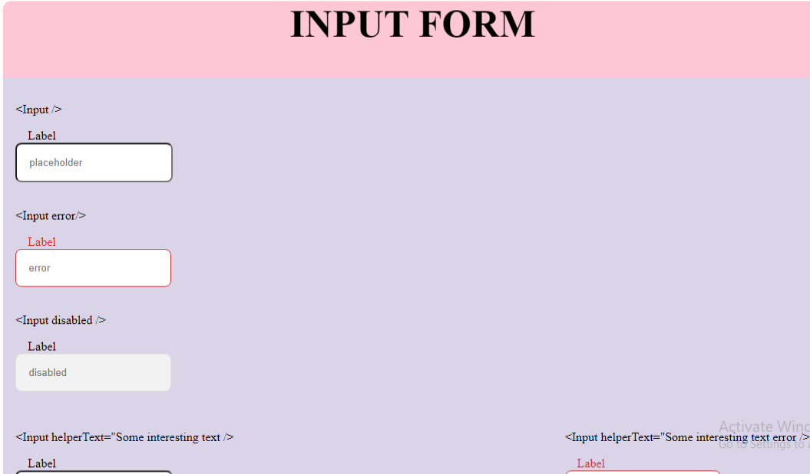
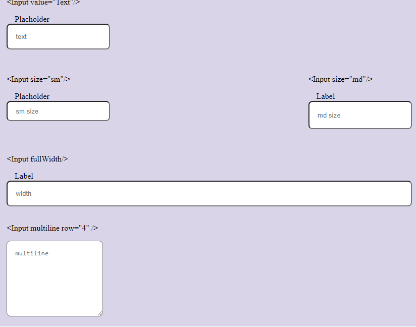

# Input Component

## Structure
In this project, I used class react in my script.js. It is not perfect, it still need more improvement.

## Screen shoot (Overview)

## It is buit with:

-  [React](https://reactjs.org/)
-  Icon: https://google.github.io/material-design-icons/ as the source of icon.
-  [Check the design here](https://www.figma.com/file/slzHnI05qpbBeC33ZMZGa5) to see the design in the figma.

## Link of this project by deploying it with netlify

[Here is the deploy link.](https://compassionate-turing-c588f5.netlify.app//)

*I am feeling very happy if there is anyone can help me to improve my code*. 

To get me in touch 
[my company email me here](mailto:peta.jea@onja.org) and [my personal email is here](mailto:jeannie.petah@gmail.com)

**Thanks in advance !!**